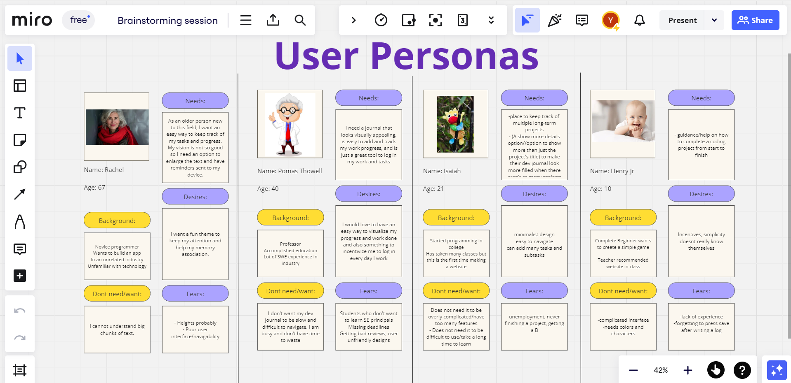
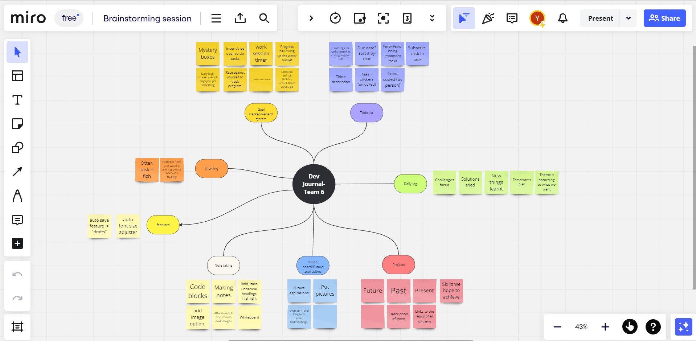
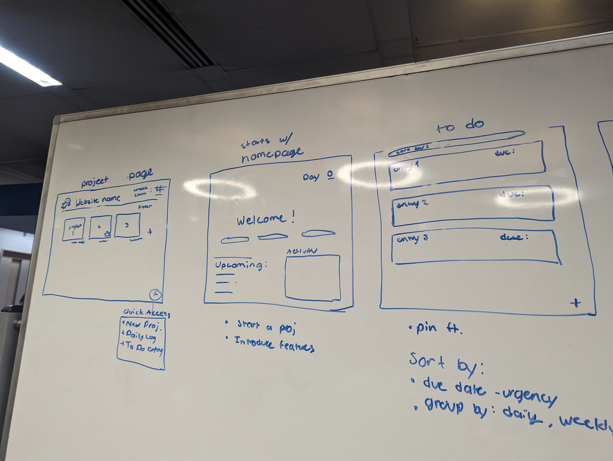
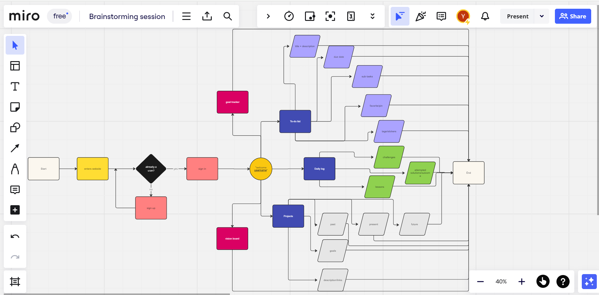
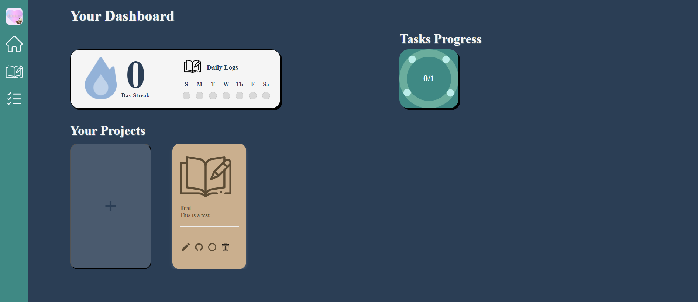
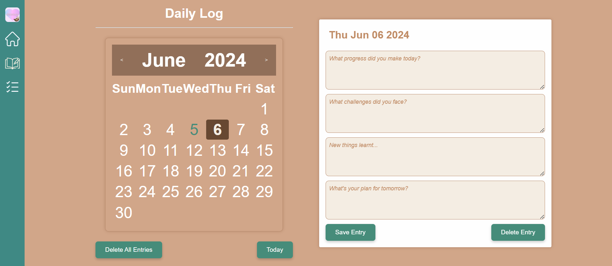
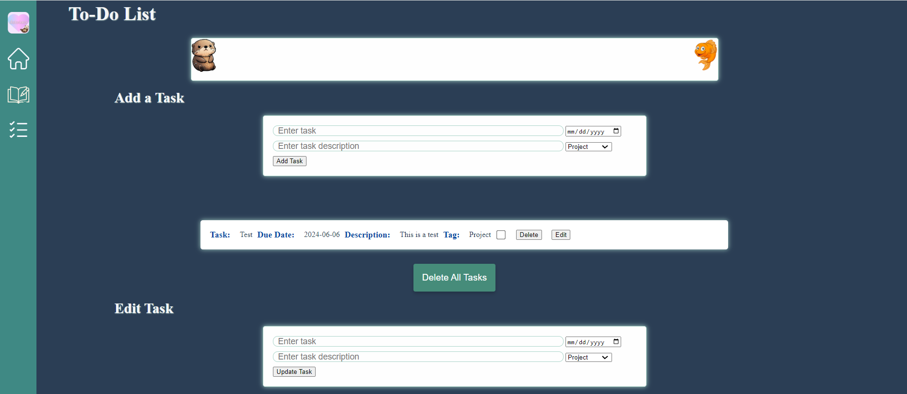

# CSE 110- Group 6: Databaes

Here is the link to our [team page](admin/team.md)!

Our teams Figma design can also be found [here](https://www.figma.com/design/VZMvKaZP4uVpx44r2jPuqO/CSE-110-Team-6-DevTool-App?node-id=2314-2&t=9r0lQ6axiaQZtOdT-1)!

### Our Brainstorming Process

In order to get an idea of what we wanted our developer journal to be, we started off with a brainstorming session including all team members and diagrammed our ideas.

During this meeting, we planned out the features we were hoping to include in our project. In order to not include biases, as well as for more possible ideas outside of just us as developers, we created user personas and user stories to facilitate the brainstorming process as shown below:

    

> We made 4 different personas, each of varying age and wants in order to get more ideas

After creating these personas we went on to create a mindmap of the possible features we wanted to include and wrote down some ideas we had in mind for each.

    

> Category for each feature/functionality, more specific details in each branch

We also made a fat marker sketch to get a rough idea of how we wanted our project to look. While it was not exactly what we went with later on, it ultimately helped us understand how we wanted our application to function.

    
    

> Fat marker sketch of our ideas

Following our initial brainstorming meeting, we then created a flow chart to demonstrate the general user flow of our application.

    

> Flow chart of the user flow we had in mind

After finalizing our rough ideas and getting an idea for what to do, we made our [team pitch](specs/pitch/CSE_110_Team_6_Pitch.pdf) to show the TA.

*All images are also posted here [here](specs/brainstorm/brainstorming_session.pdf) for a closer view.*

### Agile Development Process

Our team followed the agile development process in order to iteratively create our product through consistent meetings and frequent project updates.

**Weekly Team Meetings:**
Enforcing consistent team meetings is essential in ensuring progress can be made and checked among members, and it especially helped us in delegating tasks. Every Saturday around 5pm, our team held a meeting through Zoom where we took about an hour making sure that we knew what we were doing, sharing and issues we had, and our plans moving forward. During these meetings, we took notes which can be found [here](admin/meetings). Towards the end of the quarter, we also started meeting after Thursday's lecture just to have more time to converse amongst ourselves.

**Daily Standups:**
Daily Stand-ups are a key part in teams that follow agile development, as they allow for rapid conversation among team members to make sure everyone is on track. During these stand-ups, teams would very briefly describe the work they have done as well as their plans for the next day. While our team did not actually have daily stand-up meetings, we did implement a daily check-in system on our Slack workspace. Through this, we would make daily posts about our progress in order to make sure everyone was aware of the current status of the project. 

**Making it Offline:**
Focusing on the accessibility of our page, we wanted to create offline functionality for our application in order to ensure it would still maintain functionality when the user does not have access to the internet. We decided to use service workers for this, as we had utilized them previously in one of our Labs. Compared to other options, this ultimately accomodated for the short time we had, as learning new technologies could take time and put risk on the quality of our product.

**Retrospectives:**
Retrospectives are essential for teams following an agile development process as they provide an opportunity to reflect on what went well, what didn't, and how to improve. Our team conducted retrospectives at the end of each sprint. We used a structured format where each team member shared their thoughts on what worked, what didn't, and any suggestions for improvement. We documented these discussions in our repository and revisited them in subsequent retrospectives to track progress. We used Jamboard to conduct our retrospectives and allow everyone to reflect upon the sprint and give suggestions/feedback.

**Sprint and Sprint Reviews:**
Sprints are time-boxed periods during which specific work has to be completed. Our team typically had one/two-week sprints. At the beginning of each sprint, we held a sprint planning meeting to decide which tasks to prioritize and assign them to team members. Throughout the sprint, we tracked our progress and addressed any blockers. At the end of each sprint, we conducted a sprint review meeting to demo the completed work to stakeholders and gather feedback for future iterations.

**Testing:**
Testing was a crucial aspect of our development process to ensure the quality and reliability of our product. We adopted a test-driven development (TDD) approach, where tests were written before the implementation of features. Our testing strategy included unit tests and end-to-end tests. We used automated testing frameworks such as Jest for unit testing and Puppeteer for end-to-end testing. Additionally, we performed manual testing to validate the user experience across different devices and browsers.

**Documentation:**
Documentation played a vital role in ensuring the maintainability and scalability of our project. We maintained comprehensive documentation covering various aspects of our application, including installation instructions, architecture overview, and API documentation. We used tools like JS Docs for documenting our JavaScript and made extensive use of comments and README files. Documentation was continuously updated throughout the development process to reflect changes and additions to the codebase.

**Issues:**
We utilized an issue tracking system to manage and prioritize tasks, bugs, and feature requests. Whenever a new task or issue was identifie it was logged into our issue tracker (GitHub project integrated into our repo). Each issue was assigned to a team member, categorized (e.g., bug, feature, enhancement), and given a priority level. We regularly reviewed and updated the status of issues, ensuring transparency and accountability within the team.

#### Github Integration

**Branching Strategies:**
Our branching strategy aimed to strike a balance between minimizing complexity and facilitating collaboration. We followed a Git branching model based on feature branches. Each new feature or user story was developed in its own branch, allowing team members to work independently without interfering with each other's code. Once a feature was complete, it underwent code review before being merged into the main development branch.

**PRs:**
Pull requests (PRs) served as the primary mechanism for code review and collaboration within our team. Before merging any code changes into the main branch, a team member would create a pull request and request reviews from other team members. Code reviews were conducted to ensure adherence to coding standards, identify potential bugs or optimizations, and promote knowledge sharing. We used pull request templates to provide context and checklist for reviewers, streamlining the review process and maintaining code quality. We also created a [PR template](PULL_REQUEST_TEMPLATE.md) and made sure that every PR has at least 2 reviewers and is linked to its corresponding issue. 

**CI/CD Pipeline:**
We made use of a CI/CD pipeline to automate certain tasks. Our pipeline includes:
* Linting (using a tool called super-linter which is a collection of linters)
* Code quality check using Codacy
* Unit tests through Jest
* JS Docs generation

The main branch was protected and PRs can only be merged with main **after** completing all checks in our CI/CD pipeline.

### Our Product

Our finished product utilizes a total of 3 pages to provide all the functionality we hoped to bring, but more importantly the features we think the user would want in a developer journal. 

    

> Homepage of our application

The first page we have of our application is the homepage. From here, and any page in general, you can access the other pages with the navigation bar on the left. On the homepage, we provide an overview for the user regarding any projects and tasks they may have to work on. Through this page the user is able to add more projects they hope to work on, each with their own card that provides a description of the project and a link to the Github repository they link to it. Regarding the visuals, the page displays their current task progress as well as a daily log streak (explained more later) in hopes of encouraging consistent work.

    

> Daily Log page

The next page we created was the Daily Log page. On this page, the user is able to log anything they hoped to note down for each day. More specifically, the questions we chose can be seen on the right side. The screenshot was taken on June 6, so the grey square on the 6th indicates the current date. To its left, the green 5 indicates that a log was made on June 5. The user is able to freely access their past logs as well as add more for any days they may have missed. Going back to the home page, the daily log streak that was mentioned is a way of displaying to the user how many days in a row they have made a log. We hope the user feels more inclined to work on their tasks/write down any progress they have made with the inclusion of this feature, similar to an agile daily stand-up.

    

> Todo List page

The final page of our application is the Todo List page. This page allows the user to create tasks that they plan to work on. The different parameters of what can be included in a task can be seen in the middle. On the bottom, the option to edit any tasks can be seen in case a change has to be made. Similar to Github issues, we aimed to have this page be a similar indicator of any tasks that have to be done by the user. Relating it back to the homepage, the number of tasks can be viewed in the top-right wheel, and any tasks marked as completed will increase the total number of tasks finished on the wheel. The final aspect of this page that may cause confusion is at the very top, where an otter can be seen far from some fish. Gaining inspiration from other apps similar to ours in the sense of daily check-ins, we decided to incorporate a feature that would incentivize the user to complete their tasks. When the user finishes their created tasks, the otter (chosen as our mascot) will be able to get a nice treat!

Contributors: [Team 6](admin/team.md)!
