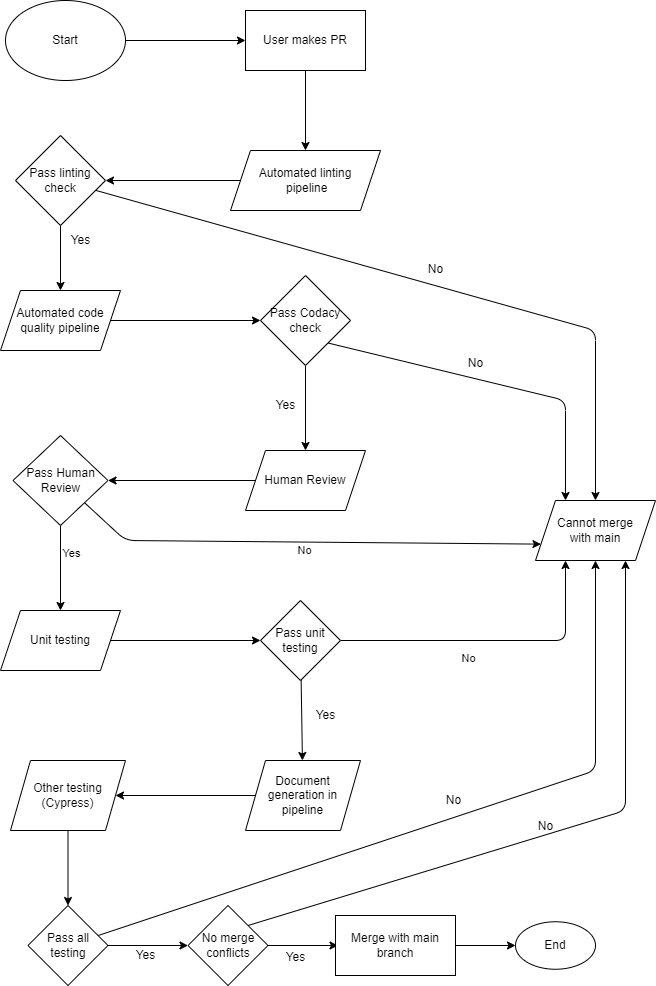

A short 2 page (roughly) status on the pipeline in terms of what is currently functional (and what is planned or in progress). Embed your diagram in the markdown file.

# Phase 1: CI/CD Pipeline Setup

In this phase, we worked on setting up the CI/CD pipeline using GitHub Actions to automate a lot of tasks and make sure that are repository is more organized and systematic. This included creating GitHub actions to lint HTML, CSS, and JavaScript code, integrating Codacy to ensure that all the code meets certain standards and passes quality checks, automate unit and e2e (end-to-end) testing. 

The primary trigger actions we chose are:

- Any code that is pushed to main should pass all checks in GitHub actions. 
- Any PR has to pass all checks before merging with main branch.

Our pipeline included the following workflows:

- Linting code in pipeline to make sure that it is consistent throughout the repository and to enforce certain styles (again, for consistency).
- Integrating Codacity to ensure our code passes a certain quality and is well-written.
- Checking code quality via human review- making sure that there are actual humans who review and approve the code when a PR is made.
- Unit testing- all code should pass certain unit tests in the pipeline before merging with main.
- Document generation so that all our code is well documented and everything is automated.
- Other testing such as e2e (end-to-end) testing.

**Everytime a PR is made, all the GitHub actions are run and a merge with main branch can only be made if all checks are passed and there are no conflicts.**

Here is a diagram of what our pipeline looks like:

Here are some more details about each of the GitHub actions:

## Code Linting

To efficiently lint our code and make sure that it is consistent, we made use of a tool called super-linter. Super-linter is a ready-to-run collection of linters and code analyzers, to help validate your source code.

The goal of super-linter is to help you establish best practices and consistent formatting across multiple programming languages, and ensure developers are adhering to those conventions.

Super-linter analyzes source code files using several tools, and reports the issues that those tools find as console output, and as GitHub Actions status checks.

We integrated this in our code mainly to check and lint HTML, CSS and JS files. This uses **stylint** for CSS code, **HTMLHint** for HTML code, and **ESLint** for Javascript code. We disabled some linters that were unimportant or that were giving unnecessary errors such as validating markdown, natural language, Javascript standard (different from ESLint- this was being problematic since the linting was too strict), GitHub actions, and infrastructure as code (Checkov).

## Code Quality Check via Codacy

To ensure that code quality in the repository meets certain standards. Codacy is a tool that helps us by automating code reviews and code quality analysis. Codacy provides insights and actionable feedback, helping you improve code quality, maintainability, and security. We made an account on Codacy, adding this organization and repository to it (to monitor code quality and other statistics/details), generated an API key and added it as a secret key to our GitHub repository, and then wrote a YAML file to create a GitHub action and automate code quality checking.

## Code Quality Check via Human Review

## Unit tests via automation
# CI/CD Pipeline Setup for Node.js Project

This document outlines the setup process for our CI/CD pipelines using GitHub Actions. Our project uses Jest for unit testing to ensure code quality and reliability.

## Overview

I implemented Jest as a testing framework:

- **Jest**: Used for its comprehensive testing capabilities and support for JavaScript and TypeScript.

This framework is integrated into our CI/CD pipeline, allowing tests to run automatically on push to the main branch or on pull request events.

# CI/CD Pipeline Setup
First, I ensured that the project was prepared with the necessary configurations. I began by including Jest as a development dependency in this project by running npm install --save-dev jest. In the package.json file, I added a script to run Jest,  "test": "jest". This allowed me to execute the tests using npm test. Next, I created a GitHub Actions workflow by adding a YAML configuration file in the .github/workflows directory of the repository. This is triggered on push events and pull requests to the main branch, setting up a job that installs dependencies, sets up the Node.js environment, and runs the Jest tests that I implemented. I added tests and ran them as I made pull requests, and ensured that they all passed and that they were ready to merge with the main branch.

## Documentation generation via automation

## Other Testing