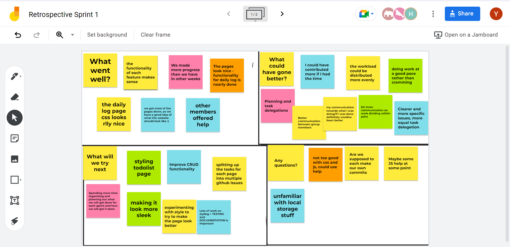

# Agile Retrospective Meeting- Sprint 1
**Location:** Zoom

**Time:** 6-6:30 pm

**Attendees:**
- Yashil
- Rona
- Emily
- Avnish
- Catherine
- Daniel
- Ramiz
- Kyungwoo
- Nathan
- Henry

We decided to discuss the questions in the retrospective amongst ourselves and made use of a Jamboard for letting everyone give their thoughts and opinions. Below are a few screenshots of our jamboard and then a summary of the highlights!

## What went well?
* Great MVP
* Good progress till now
* GitHub looks quite structured

## What could have gone better? 
* Better division of work
* Clearer and more specific issues
* Better time planning 

## What will we try next? 
* Styling for pages
* Testing
* Documentation
* Spending more time organizing and planning

## What questions do we have? 
* Help needed in JS and CSS
* Does everyone have to make commits?

## Overall feedback 
### How happy were you with how we worked as a team?
  * Good work, more needs to be done on dividing work
  *  
### Did you feel you got a fair share of work? Do you want more things to do or feel like you got had a heavier workload than others?
  * Yes, uneven workload
  * We'll work more on this in our next sprint!
### Any feedback for the leads?
  * Good feeedback!

Here is the link to the [Jamboard](https://jamboard.google.com/d/1O8Cw18QOvZ55DHCABL-Gzs9F6-ZFFp_Z4R1IGc-NOd0/edit?usp=sharing).

## Jamboard Screenshots

Here are some other questions we discussed!

**How are you feeling right now?**

Anything that you were mad/annoyed about?
Anything that you were sad about?
Anything that you were glad about

=======
# Agile Retrospective Meeting- Spring 1
**Location:** Zoom

**Time:** 6-6:30 pm

**Attendees:**
- Yashil
- Rona
- Emily
- Avnish
- Catherine
- Daniel
- Ramiz
- Kyungwoo
- Nathan
- Henry

We decided to discuss the questions in the retrospective amongst ourselves and made use of a Jamboard for letting everyone give their thoughts and opinions. Below are a few screenshots of our jamboard and then a summary of the highlights!

## What went well?
* Great MVP
* Good progress till now
* GitHub looks quite structured

## What could have gone better? 
* Better division of work
* Clearer and more specific issues
* Better time planning 

## What will we try next? 
* Styling for pages
* Testing
* Documentation
* Spending more time organizing and planning

## What questions do we have? 
* Help needed in JS and CSS
* Does everyone have to make commits?

## Overall feedback 
### How happy were you with how we worked as a team?
  * Good work, more needs to be done on dividing work
  *  
### Did you feel you got a fair share of work? Do you want more things to do or feel like you got had a heavier workload than others?
  * Yes, uneven workload
  * We'll work more on this in our next sprint!
### Any feedback for the leads?
  * Good feeedback!

Here is the link to the [Jamboard](https://jamboard.google.com/d/1O8Cw18QOvZ55DHCABL-Gzs9F6-ZFFp_Z4R1IGc-NOd0/edit?usp=sharing).

## Jamboard Screenshots

Here are some other questions we discussed!

**How are you feeling right now?**

Anything that you were mad/annoyed about?
Anything that you were sad about?
Anything that you were glad about